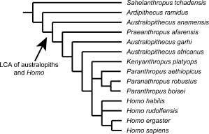
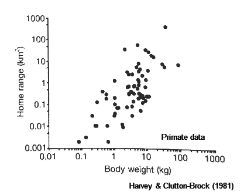
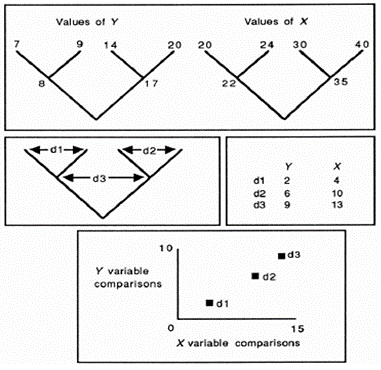
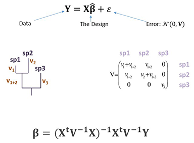
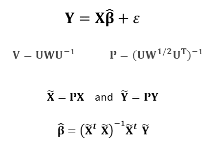

### **Overview**
This tutorial is intended to provide an introduction to the basics of implementing several phylogenetic comparative methods using R. As with previous tutorials, we begin with a brief conceptual overview, which sets the stage for why this is type of analysis is crucial for correct macroevolutionary inference. Then, we go over the basics of reading data and phylogenies into R, evaluating the degree to which phylogenetic signal is present in a continuous trait, and learn three ways to examine bivariate trait associations in continuous data: phylogenetically independent contrasts (PIC), phylogenetic generalized least squares (PGLS), and phylogenetic transformation methods. 

### Download data files
To run the analyses in this tutorial, please download the following files from our Git-course repository: 

[Phylogeny](https://eeob-macroevolution.github.io/EEOB-565X-Spring2018/practicals/TutorialData/Mander.tre)

[Data1](https://eeob-macroevolution.github.io/EEOB-565X-Spring2018/practicals/TutorialData/HydromantesMns.csv)

[Data2](https://eeob-macroevolution.github.io/EEOB-565X-Spring2018/practicals/TutorialData/PlethodonMns.csv)

Additionally, The R-script for running the code found in this tutorial is found here:

[RScript](https://eeob-macroevolution.github.io/EEOB-565X-Spring2018/practicals/TutorialData/PhyloRegressionContinuous.r)

Then, on your local computer, place them in a folder named 'TutorialData', which is found in the same directory as this tutorial. 

#### **Conceptual Background**
First, let's recall why it is necessary to consider the phylogenetic relationships among taxa when performing comparative analyses. In macroevolutionary studies, we are often interested in determining how two or more traits covary across a broad set of taxa. In such cases, phenotypic values are often obtained at the species level, and represent the typical value for each species (e.g., mean adult body size). However, we know that species are not independent, as they share an evolutionary history as described by their phylogenetic relationships. The figure below illustrates the issue. Here we see an estimate of the phylogeny for hominins (Straight et al. 2013), which displays the evolutionary relationships among these taxa. From this figure, it is evident that sister species such as *H. sapiens* and *H. ergaster* are most closely related to  one another than, say,  *H. sapiens* and *A. anamensis*, which are more distantly related. Combining the relationships depicted in this phylogeny with Darwin's principle of descent with modification, we can generate the following expectation: that *H. sapiens* and *H. ergaster* are likely to be more similar in the trait values of their phenotypes than are *H. sapiens* and *A. anamensis*. This is because *H. sapiens* and *H. ergaster* are more closely related to one another phylogenetically. 



Now consider the case where we have measured two traits for a series of primate species, body weight and home range size (Fig. 2). Visually there appears to be a clear relationship between the two traits, but how can we test this empirically?  




As a quantitative biologist, one would natuarlly consider linear regression, and perhaps correlation, to be an appropriate statistical tool in this case. However, using ordinary least squares (OLS) methods, one assumes that the residual error from such models is identical and *independently* distributed. This expectation is expressed mathematically as: *N*(0,1). However, because the data points in Fig. 2 represent species values, we encounter the non-independence issue. In particular, the species are not independent, because they exhibit a shared evolutionary history as described by their phylogeny. 

As such, the expected covariation between taxa is not iid: *N*(0,1). Instead, it is expressed as: *N*(0,**V**) where **V** is the expected covariance matrix described by the phylogeny and the evolutionary model under consideration (termed the *phylogenetic covariance matrix*). It is the non-independence expressed in **V** that must be accounted for during the regression analysis. 

Numerous analytical methods have been developed to take phylogeny into account, which collectively are termed *phylogenetic comparative methods* (PCMs). DCA prefers to call them the *Phylogenetic Comparative Toolkit*, as a panoply of methods now exists. What links them conceptually is that they all utilize a phylogenetic perspective when evaluating patterns of trait evolution. Mathematically, these methods *condition* the data on the phylogeny during the analysis. Today we will learn how to implement the most commonly used methods for continuous variables: methods for implementing **Phylogenetic Regression**. 

### **Illustrating the Problem**

To illustrate the problem with a real-world example, let's simulate some data phylogenetically. This is also a useful skill to learn in R!

NOTE: in the R-scripts below various R-libraries are called, each of which has specific functions related to phylogenetic comparative analyses. One should take the time to become familiar with which functions are found in which R-libraries so as to minimize confusion when you run PCMs on your own data!

```{r eval=TRUE}
library(phytools)

#A quick simulation
mytree<- pbtree(n=50, scale=1) #one way to simulate a tree
  #note: in R, one has functions to simulate BD trees, random splits trees, etc. using different functions
plot(mytree)
X<-fastBM(tree=mytree) #simulates a continuous trait on phylogeny under Brownian motion
Y<-fastBM(tree=mytree)
cor(X,Y) #Not zero

#Now, what happens if we do this many times?
nsim=1000
trees<-pbtree(n=50, scale=1, nsim = nsim) #100 PB trees
X<-lapply(1:nsim, function(j) fastBM(tree=trees[[j]]))
Y<-lapply(1:nsim, function(j) fastBM(tree=trees[[j]]))
cor.raw<-unlist(lapply(1:nsim, function(j) cor(X[[j]],Y[[j]])))
hist(cor.raw, xlim=c(-1,1))  
```

Notice that the mean of this distribution is close to zero, which is expected given that X & Y were simulated with no input correlation between them. Note that this mean will converge to exactly zero as nsim increases.

However, also pay attention to the distribution of correlation coefficients. It is very broad

```{r eval=TRUE}
#Now condition on phylogeny:
X.pic<-lapply(1:nsim, function(j) pic(x = X[[j]],phy = trees[[j]]))
Y.pic<-lapply(1:nsim, function(j) pic(x = Y[[j]],phy = trees[[j]]))
cor.pic<-unlist(lapply(1:nsim, function(j) cor(X.pic[[j]],Y.pic[[j]])))
hist(cor.pic, xlim=c(-1,1)) #mean near zero, but LOOK at variation!
```

What we see in this case is that when we condition on the phylogeny, we have better statistical estimates with tigher confidence intervals, as the error variance in our data more closely matches the assumed error covariance (see discussion in Rohlf 2006. Evol. and elsewhere).

### **Bringing my Data into R**
Now, say we have our own data and wish to perform a phylogenetic comparative analysis. Our first step is to read the data and the phylogeny into R and 'link' them up. This step is crucial, as we need a way to connect the species trait values in the data matrix with the corresponding branches on the phylogeny. Another important step in this process is pruning. It is very common that the phylogeny has more taxa than the data matrix (because one is utilizing a phylogeny from a broad molecular study), or that the data matrix may contain data for species not represented in the phylogeny. Both types of 'dangling' taxa must be excised from their respective data objects. 

Our first step is to load various R-libraries which contain functions for reading and manipulating phylogenetic datasets. There are many such packages, but the 'central' phylogenetics R package is **ape**. This package has many functions for reading and manipulating phylogenetic trees, as well as numerous quantitative analysis performed in a phylogenetic perspective. Many other phylogenetics-R packages also load *ape* or some of its components.

Also critical for linking up data and a phylogeny is that one must have the species names as a component in the data matrix **EXACTLY** as they are found in the phylogeny [names(Y) or rownames(Y) depending on input type] match those on the phylogeny [phy$tip.label]: 
```{r eval=TRUE}
library(ape)	
library(geiger)

#Here is a large time-dated molecular phylogeny (a chronogram):
ManderTree<-read.tree("TutorialData/Mander.tre",tree.names=T)
plot(ManderTree)

#Now read in data for species in the genus Hydromantes
Hyd.dat<-read.csv("TutorialData/HydromantesMns.csv", header=TRUE, row.names = 1)
Hyd.dat  #Notice we read in the first row as row.names. These MUST match the names in the phylogeny

#Now, prune the tree to match the data and vice-versa:
Hydro.new<-treedata(phy=ManderTree,data = Hyd.dat, warnings=FALSE)
plot(Hydro.new$phy)  #We have matched data to the tree!

```

### **Methods for Implementing Phylogenetic Regression**
#### 1: Phylogenetically Independent Contrasts
Now it is time to put it all together and perform a phylogenetic comparative analysis. Using what we have learned, we will read in a chronogram and read in a matrix of quantitative data. In this case, the data are a set of continuous linear measurements representing morphology. Next, we will perform a bivariate regression of two traits to evaluate the evolutionary association between them. We will do so using phylogenetically independent contrasts (PIC). 

First however, recall what PIC does. The approach (Felsenstein 1985) does not perform correlation or regression on the data at the tips of the phylogeny, but rather generates a set of contrast scores at each node of the phylogeny. Under Brownian motion, these are independent of one another and of the phylogeny. One uses the pruning algorithm to work down the phylogeny from tips to root, and obtains a set of N-1 contrasts for N taxa. These are then used in the comparative analysis. The approach is shown conceptually in Fig. 3. 



Now let's try this for our dataset:

```{r eval=TRUE}
#Read in data, phylogeny, and match/prune them to one another
ManderTree<-read.tree("TutorialData/Mander.tre",tree.names=T)
   plot(ManderTree)
Mander.dat<-read.csv("TutorialData/PlethodonMns.csv", header=TRUE, row.names = 1)
Gps<-Mander.dat[,12]; names(Gps)<-row.names(Mander.dat)
Mander.dat<-Mander.dat[,-12]  #must remove prior to 'treedata', which does not like factors

Pleth.new<-treedata(phy=ManderTree,data = Mander.dat, warnings=FALSE)
   plot(Pleth.new$phy)  
SVL.new<-Pleth.new$data[,1] #grabs appropriate column from data matrix after treedata
HL.new<-Pleth.new$data[,3]
  match(names(Gps),row.names(Pleth.new$data))  #double check that the factor matches
   
#Phylogenetically-naive analyses
plot(SVL.new,HL.new)
cor.test(SVL.new,HL.new)  #correlation of two traits: pretty high
anova(lm(HL.new~SVL.new))

#Generate PICs and test while conditioning on phylogeny
X.pic<-pic(x = SVL.new, phy = Pleth.new$phy) 
Y.pic<-pic(x = HL.new, phy = Pleth.new$phy) 
cor.test(X.pic,Y.pic)
plot(X.pic,Y.pic)
anova(lm(Y.pic~X.pic+0))   #regression through the origin (b/c order of taxa for contrast is arbitrary [can 'spin' on node])
summary(lm(Y.pic~X.pic+0))   #coefficients of the model

```

We have just performed our first phylogenetic comparative analysis of trait correlation! Our findings are as follows: when conditioned on the phylogeny, there was a significant relationship between body size and head length. This reveals a strong pattern of evolutionary covariation between the two traits at a macroevolutionary scale.  

#### 2: Phylogenetic Generalized Least Squares

Now let's investigate the same pattern using a different mathematical implementation. Recall from lecture that PICs are a wonderful algorithm for conditioning the data on the phylogeny which results in a set of contrasts that are independent of phylogenetic relationships. However, one could also consider the problem from a purely statistical perspective. Consider standard regression. Ordinary least squares (OLS) methods assume that the residual error is iid: *N*(0,1). However, a phylogeny explicitly describes non-independence between species. This may be encoded in a *phylogenetic covariances matrix* **V**, which may be used to model the error covariance in a *Generalized Least Squares* (GLS) regression. This approach is more flexible and using PICs, as one may perform any model of the form Y~X while conditioning on the phylogeny (e.g., regression, ANOVA, multiple regression, etc.). As we will see later in the semester, the approach is also more flexible in that non-Brownian motion models may be incorporated by using a different expected covariance matrix **V**. With PGLS, the statistical procedure is the same as our familiar OLS regression with the exception that non-independence is accounted for using weighted LS approaches (Fig. 4). 



```{r eval=TRUE}
#To perform PGLS in R, we must first estimate the phylogenetic covariance matrix V:
V<-corBrownian(phy=Pleth.new$phy)

#Now we run the analysis:
library(nlme)
bm.gls<-gls(HL.new~SVL.new,correlation = V, data=data.frame(SVL.new, HL.new))
summary(bm.gls)    
anova(bm.gls)
```

There are two important things to notice here. First, the model parameters (e.g., regression coefficient) is *IDENTICAL* to what was estimated using PICs.  Second, the F-value and significance of the model is also the same. Thus we have (re) verified that PIC and PGLS are identical mathematical procedures, so long as one performs them correctly! (see also Garland and Ives, 2000; Rohlf, 2001; Blomberg 2012 and others).


#### 3: Phylogenetic Transform

A third implementation of phylogenetic regression is to use phylogenetic transformation. Here we take the phylogenetic covariance matrix **V** and from it obtain a matrix that re-expresses the expected non-independence through a series of axes representing a transformed dataspace. The X and Y data are then multiplied by this transformation matrix (ie., they are projected into the new dataspace). This results in data that have been conditioned on the phylogeny. As such the resulting data are independent of one another, and standard OLS methods may be used (see Garland and Ives, 2000; Adams 2014; Adams and Collyer 2018).  The approach is illustrated graphically in Fig. 5. 



```{r eval=TRUE}
#To perform an analysis using phylogenetic transform in R, we do the following:
library(geomorph) 
gdf<-geomorph.data.frame(SVL=SVL.new,HL=HL.new,Gps=Gps, tree=Pleth.new$phy)
res.PhyT<-procD.pgls(HL~SVL, data = gdf, phy = Pleth.new$phy, print.progress = FALSE)
summary(res.PhyT)    #Same F-ratio as before (note: p-value found using permutation in this case)
res.PhyT$pgls.coefficients  #Same parameter estimates as before
```

Once again we see that parameter estimates and statistical summaries (F-ratios) are identical to both PIC and PGLS.  The advantage of this last approach however, will become clear in a few weeks.  This implementation may be used for examining patterns in highly-multivariate phenotypes (Y), whereas parametric versions of PIC and PGLS cannot be used. 

### Related Topics

#### Phylogenetic ANOVA
In addition to the three implementations of phylogenetic regression reviewed above, there are several other related analyses of interest. Perhaps the most obvious is performing analysis of variance (ANOVA) in a phylogenetic framework. There are two options. First, one may use the simulation procedure of Garland et al. (1993). This approach to 'phylogenetic anova' does *NOT* condition the analysis on the phylogeny, but rather uses an OLS ANOVA to obtain a statistical summary for the observed data, and then generates a set of possible response (Y) data via phylogenetic simulation; where traits are simulated on the phylogeny under a Brownian motion model (as above). OLS ANOVA is then performed on each simulated dataset, from which the F-ratios are obtained. This generates a distribution of possible F-values against which the observed is compared. 

A second procedure using phylogenetic transformation and permutation (RRPP). Here the data are first conditioned on the phylogeny and an ANOVA performed. This approach is identical to that used in phylogenetic regression via transformation as per above. Then, permutation of residuals is used to assess significance (RRPP: Adams and Collyer, in review). One can also use gls for univariate analsyes:

```{r eval=TRUE}
#Phylogenetic anova
aov.phylo(SVL.new~Gps, phy = Pleth.new$phy)
procD.pgls(SVL~Gps, data = gdf, phy = Pleth.new$phy,print.progress = FALSE)
anova(gls(SVL.new~Gps,correlation = corBrownian(phy=Pleth.new$phy), data=data.frame(SVL.new, Gps)))  #identical to Phylo.transform
```


Remember, phylogenetic ANOVA via simulation (Garland et al. 1993) does *not* condition the data on the phylogeny. It uses OLS ANOVA followed by BM simulations for possible results. This is why the F-ratio differs in the first method above as compared to the other two approaches (PGLS and phylogenetic transform). The latter two methods *do* condition the data on the phylogeny during the analysis. 

####Phylogenetic Signal
Another question one commonly asks is: "To what extent does my data display phylogenetic signal?"  Generally speaking, phylogenetic signal is the degree to which trait similarity reflects phylogenetic relatedness. That is, it describes the extent to which closely related species are similar in their trait values. Several methods have been proposed for this, the two most common of which are K (kappa: Blomberg et al. 2003; Adams, 2014), and lambda (Pagel 1994). Here we use the former method. 

```{r eval=TRUE}
#Phylogenetic Signal
phylosig(tree=Pleth.new$phy, x=SVL.new, method="K", test=T, nsim=1000)  #phytools
  res<-physignal(A=SVL.new,phy = Pleth.new$phy, print.progress = FALSE)   #geomorph
summary(res)  #the same, but the latter method (from geomorph) can accomodate multivariate data
plot(res)
```

####Additional Simulation Approaches
Sometimes we may wish to simulate data with a known correlation between traits under Brownian motion. In this case, we cannot simulate each trait separately, as that is tantamount to simulating data with no correlation. 

In the non-phylogenetic (OLS) world, simulating such data is accomplished using an input covariance matrix. The following is an example:

```{r eval=TRUE}
library(MASS)
R<-matrix(0.7, nrow=2,ncol=2); diag(R)<-1
dat.sim<-mvrnorm(n=10000,Sigma = R,mu = c(0,0))
plot(dat.sim, asp=1)
```

To simulate correlated traits under Brownian motion on a phylogeny, we use the function 'sim.char':  

```{r eval=TRUE}
mytree<- pbtree(n=100, scale=1) #one way to simulate a tree
R<-matrix(0.7, nrow=2,ncol=2); diag(R)<-1
dat.BM<-sim.char(phy = mytree,par = R,nsim = 1)[,,1]
plot(dat.BM, asp=1)
```

##Practical Questions

To apply what you have learned, please do the following:

1: Simulate a phylogeny (or read one into R)
2: Simultate two continuous traits with some known correlation between them
3: Estimate the evolutionary association of the traits, conditioned on the phylogeny, using one of the methods you have learned

Upload your code to the assignment center on Canvas 
