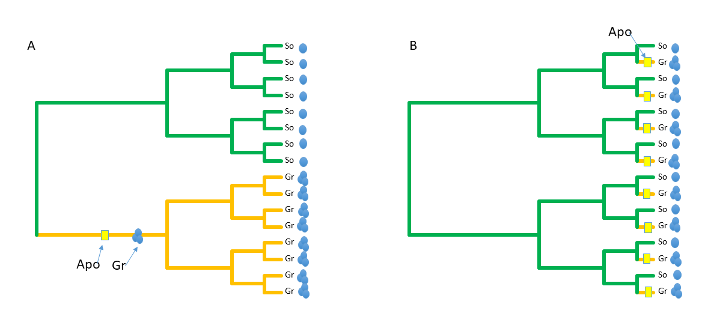
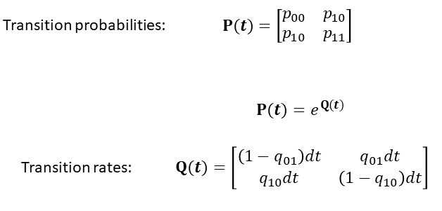
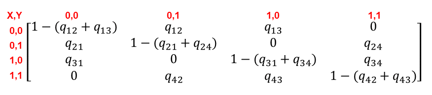

### **Overview**
Today we continue our investigation of correlated trait evolution, and implement methods for examining trait associations in discrete traits. Conceptually, the challenge is little different from what was examined for continuous variables. Specifically, we wish to identify an association between two variables while accounting for (e.g., conditioning) the data on the phylogeny.  For bivariate regression, we used one of three implementations of phylogenetic generalized least squares: phylogenetically independent contrasts (PIC), phylogenetic generalized least squares (PGLS), and phylogenetic transformation. For trait associations between discrete changes, we use likelihood or Bayesian approaches. 

### Download data files
To run the analyses in this tutorial, please download the following files from our Git-course repository: 

[Phylogeny](https://eeob-macroevolution.github.io/EEOB-565X-Spring2018/practicals/TutorialData/tree.64.tre)

[Data](https://eeob-macroevolution.github.io/EEOB-565X-Spring2018/practicals/TutorialData/DiscreteData.csv)

Additionally, The R-script for running the code found in this tutorial is found here:

[RScript](https://eeob-macroevolution.github.io/EEOB-565X-Spring2018/practicals/TutorialData/PhyloAssocDiscrete.r)

As before, on your local computer, place them in a folder named 'TutorialData', which is found in the same directory as this tutorial. 


#### **Conceptual Background**
Recall that in macroevolutionary studies, we are often interested in determining how two or more traits covary across a broad set of taxa. For continuous variables, this is a 'regression' problem: we statistically quantify the degree of covaraition between Y and X while accounting for the phylogenetic relationships among species. If a significant relationship is observed, we can conclude that there is an evolutionary association between Y and X, which may be due to some biological factor of interest (e.g., natural selection, adaptation, etc.).

As evolutionary biologists we may wish to ask very similar questions when our phenotypic data are not continuous, but are instead discrete. For example, we may have species with two color 'states': aposematic or cryptic. And these same species may be classified behaviorally as either solitary or gregarious.  An interesting evolutionary question would be: Is there an association between behavior and coloration?  Put another way, are cryptic species more often solitary, while aposematic are gregarious? From the data in Fig 1., we may wish to test this hypothesis statistically.


One might be tempted to simply perform a Chi-square test on these data. However, this ignores evolutionary history, adn how these are distributed on the phylogeny can make an enormous difference! In case 1 (Fig. 2A) the traits are clustered in two sub-lineages, implying that a single evolutionary transition in each trait could have caused our pattern. This is not overly impressive evolutionarily, as it represents an N = 1 case.  On the other hand, case 2 (Fig. 2B) shows many independent associations of the two traits. This is far more impressive. Clearly, taking phylogeny into consideration is absolutely essential for correct biological inference.  




### **Bringing Data into R**
Before we perform our comparative analysis we must read in our data and our phylogeny into R, and 'link' them up by pruning them relative to one another so that all taxa in the tree are found in the data matrix and vice versa. Recall that for this to work properly, the rownames of our data matrix (or 'names' of a vector if a single variable) must match the names of the taxa at the tips of the phylogeny. These are found as: phy$tip.label: 
```{r eval=TRUE}
## 1: Read data, tree, and prune/match one to the other
library(geiger) 
library(phytools)

#Here is a large time-dated molecular phylogeny (a chronogram):
tree<-read.tree("TutorialData/tree.64.tre",tree.names=T)
plot(tree, show.tip.label = FALSE)
mydata<-read.csv('TutorialData/DiscreteData.csv', row.names=1, header=TRUE)
mydata[1:10,]

#Match data with tree
data.pruned<-treedata(phy=tree,data = mydata, warnings=FALSE)
tree<-data.pruned$phy
mydata<-data.pruned$data

#Plot data on tree
plot.phylo(tree,show.tip.label = F)
tiplabels(pie = to.matrix(mydata[,1],sort(unique(mydata[,1]))),piecol=c("red", "black"),cex=.3, offset=0)
tiplabels(pie = to.matrix(mydata[,3],sort(unique(mydata[,1]))),piecol=c("green", "orange"),cex=.3, offset=.2)

```

### **Phylogenetic Analysis of Discrete Characters**
#### 1: Single trait analysis: transition rate comparison
One component of phenotypic pattern that differs between discrete and continous traits concerns transition rates. With continuous data, we envisioned trait change following Brownian motion, where changes in trait values were independent from time step to time step, both in terms of their magnitude (how much change), and their direction (positive or negative change relative to the previous step).  For discrete traits, one can also model trait change that way, and in fact several models do so based on MCMC properties (which also underly Brownian motion). However, because there are a finite number of states, one can ask additional questions about pattern.

For instance, is the rate of change from state A -> B greater than the rate of change 'back' from B -> A? This question has little meaning for continuous traits, but could be very important for discrete traits. These values are embodied in the transition rate matrix **Q**, which is obtained from the estimated probability matrix (Fig. 3). Derivation of these matrices is described in Pagel (1994). 



From these we can pose a question and test a hypothesis:  Is the evolutionary transition rate from state A-> B the same as the transition rate from B -> A? Evaluating this hypothesis requires fitting two evolutioanry models to the data: one where the rates (qAB, qBA) are equal, and one where the two rates are allowed to vary. The fit of these models may then be evaluated using likelihood ratio tests (LRT), AIC values, or some other statistical approach. Below is an example.

```{r eval=TRUE}
library(corHMM)
   #Set up initial rate matrices
rmat.er<-rate.mat.maker(rate.cat=1, hrm=FALSE, ntraits=1, nstates=2, model="ER")  #equal transition rates
rmat.ard<-rate.mat.maker(rate.cat=1, hrm=FALSE, ntraits=1, nstates=2, model="ARD") #unequal transition rates
rmat.er   #all rates the same
rmat.ard  #all rates different 
   #Set up data
trt1<-cbind(row.names(mydata),mydata[,1])
trt2<-cbind(row.names(mydata),mydata[,3])
trt3<-cbind(row.names(mydata),mydata[,5])

#Fit models: TRAIT 1
plot.phylo(tree,show.tip.label = F)
tiplabels(pie = to.matrix(mydata[,1],sort(unique(mydata[,1]))),piecol=c("red", "black"),cex=.3, offset=0)
res1.er<-corHMM(tree,trt1,rate.cat=1,rate.mat=rmat.er,node.states="marginal") 
res1.er
res1.ard<-corHMM(tree,trt1,rate.cat=1,rate.mat=rmat.ard,node.states="marginal") 
   #compare models: logL and AIC
res1.er$loglik 
res1.ard$loglik  #identical in this case: no need for formal LRT 
res1.er$AICc
res1.ard$AICc    #Choose simpler model (lower AICc b/c fewer parameters and same logL)
res1.er$solution  #rate transition parameters

```

The comparison reveals that the more complex model (different rates) is *not* a better fit as compared to the simpler model (equal rates). Thus, one would conclude that the rate of change from state A -> B is equivalent to the rate of change from B -> A for these data. 

Another example: 
```{r eval=TRUE}
#Fit models: TRAIT 2
plot.phylo(tree,show.tip.label = F)
tiplabels(pie = to.matrix(mydata[,3],sort(unique(mydata[,3]))),piecol=c("red", "black"),cex=.3, offset=0)
res2.er<-corHMM(tree,trt2,rate.cat=1,rate.mat=rmat.er,node.states="marginal") 
res2.ard<-corHMM(tree,trt2,rate.cat=1,rate.mat=rmat.ard,node.states="marginal") 
#compare models: logL and AIC
res2.er$loglik 
res2.ard$loglik  #identical in this case: no need for formal LRT 
res2.er$AICc
res2.ard$AICc    #Choose simpler model (lower AICc b/c fewer parameters and same logL)
res2.er$solution  #rate transition parameters

```

And a third example: 
```{r eval=TRUE}
#Fit models: TRAIT 3
plot.phylo(tree,show.tip.label = F)
tiplabels(pie = to.matrix(mydata[,5],sort(unique(mydata[,5]))),piecol=c("red", "black"),cex=.3, offset=0)
res3.er<-corHMM(tree,trt3,rate.cat=1,rate.mat=rmat.er,node.states="marginal") 
res3.ard<-corHMM(tree,trt3,rate.cat=1,rate.mat=rmat.ard,node.states="marginal") 
#compare models: logL and AIC
res3.er$loglik 
res3.ard$loglik
LRT<- -2*(res3.er$loglik - res3.ard$loglik)  #LRT test
LRT
1-pchisq( LRT,df = 1)  #probability of LRT
res3.er$AICc
res3.ard$AICc    #ARD preferred
res3.ard$solution  #rate transition parameters

```


In this last case, there is strong statistical evidence that the transition rates differ from one another. Specifically, the transition from 1 -> 0 (Q10) is much higher than Q01. 
Note that in all of these, we don't just run the analysis!  We always plot the data!!!

#### 2: Two trait analysis: Trait association
Having examined questions concerning rates of change between states of a single trait, we can now return to the question of correlated evolution. Here we wish to know whether two traits are associated phylogenetically. For continuous traits, this is akin to phylogenetic regression or correlation. However, for discrete traits, this question becomes one of evaluating transition rates between sets of trait changes.  

In essence, this is a generalization of the rate matrix for a single trait, only now we consider two traits. Here, we have a 4 X 4 rate matrix describing the transition rates between character states for 2 traits  (Fig. 4).  



To evaluate trait associations we now fit two models. The first is our 'independent' model. Here transition rates are the same regardless of trait state (in other words, the rate is independent of the row or column in the matrix). One then fits the data to the phylogeny under this model.  

```{r, echo = F}
rate.mat.maker(rate.cat=1, hrm=FALSE, ntraits=2, nstates=2, model="ER")
```

The second model is describes correleted (dependent) trait evolution. Here the trait changes depend on the initial state. This model has more free parameters, as all transition rates are permitted to differ from one another. One then fits the data to the phylogeny under this second model. 

```{r, echo = F}
rate.mat.maker(rate.cat=1, hrm=FALSE, ntraits=2, nstates=2, model="ARD")
```

Finally, the fit of the data to the phylogeny under the two models (null and alternative) are statistically compared to one another. This may be done using LRT, AIC comparisons, or some other procedure. (NOTE: this approach is *the* standard statistical protocol for model comparison). Several examples follow:

```{r eval=TRUE}
#Compare dependent (correlated) change model (ARD) with independent change model (ER)  #See Pagel 1994
trtset12<-cbind(row.names(mydata),mydata[,1:2])
trtset34<-cbind(row.names(mydata),mydata[,3:4])

#Traits 1&2
plot.phylo(tree,show.tip.label = F)
tiplabels(pie = to.matrix(mydata[,1],sort(unique(mydata[,1]))),piecol=c("red", "black"),cex=.3, offset=0)
tiplabels(pie = to.matrix(mydata[,2],sort(unique(mydata[,2]))),piecol=c("green", "orange"),cex=.3, offset=0.2)
disc.res12.er<-corDISC(tree,trtset12,ntraits=2,model="ER",node.states="marginal") 
disc.res12.ard<-corDISC(tree,trtset12,ntraits=2,model="ARD",node.states="marginal") 
disc.res12.er$loglik
disc.res12.ard$loglik
LRT<- -2*(disc.res12.er$loglik - disc.res12.ard$loglik)  #LRT test
1-pchisq( LRT,df = 4)  #probability of LRT
disc.res12.er$AIC
disc.res12.ard$AIC   #STRONG SUPPORT for correlated (dependent) evolution
   #Implemented in phytools
tr1<-mydata[,1]; names(tr1)<-row.names(mydata)
tr2<-mydata[,2]; names(tr2)<-row.names(mydata)
disc.res12.b<-fitPagel(tree,x=tr1,y=tr2)
disc.res12.b
```

**IMPORTANT NOTE**:  Look at the phylogeny and the data here!  From the statistical analysis we have strong and significant support for correlated evolution. However, in examining the data on the phylogeny we see that both traits are co-distributed and clustered. That is, each state for each trait is found on a single sub-lineage of the phylogeny. As such a single evolutionary shift could explain the observed pattern (need ancestral state estimation to do this: next week).  

The point is that a single change of each trait is not overly impressive evolutionarily.  We have just encountered the 'BiSSE' problem for correlated evolution!  **TAKE-HOME MESSAGE: ALWAYS PLOT ONE'S DATA!!!! DON'T JUST RUN THE STATISTICAL ANALYSIS**

Another example:

```{r eval=TRUE}
plot.phylo(tree,show.tip.label = F)
tiplabels(pie = to.matrix(mydata[,3],sort(unique(mydata[,3]))),piecol=c("red", "black"),cex=.3, offset=0)
tiplabels(pie = to.matrix(mydata[,4],sort(unique(mydata[,4]))),piecol=c("green", "orange"),cex=.3, offset=0.2)
disc.res34.er<-corDISC(tree,trtset34,ntraits=2,model="ER",node.states="marginal") 
disc.res34.ard<-corDISC(tree,trtset34,ntraits=2,model="ARD",node.states="marginal") 
disc.res34.er$loglik
disc.res34.ard$loglik 
disc.res34.er$AIC
disc.res34.ard$AIC # VERY STRONG SUPPORT FOR CORRELATED EVOLUTION
```

Here we are more inclined to interpret this result evolutionarily, as there are now many independent evolutionary shifts contributing to the observed correlated pattern (see Maddison and FitzJohn 2015: also Fig. 5 below).


#### 3: Two trait analysis: Directional tests
Sometimes we have evolutionary hypotheses that require directionality:  "Did the evolution of aposematic coloration precipitate the evolution of gregariousness?" To answer such questions, one must create a model where changes in one trait facilitate changes in another trait. This entails alteration of components in the expected rate matrix *Q*. For example: 

```{r eval=TRUE}
eq.rat<-rate.mat.maker(rate.cat=1, hrm=FALSE, ntraits=2, nstates=2, model="ER")
eq.rat
dir.rat<-eq.rat; dir.rat[1,2]<-2; dir.rat[3,4]<-3  #e.g., q12<>q34: see Table in Pagel 1994
dir.rat
```

In this case, the equal rate model is the null, whereas the directional rate model is the alternative. For this example, we are explicitly testing the hypothesis that shifts in trait Y from 0 -> 1 are facilitated by trait X being in state '0', because we are allowing Q(00->01) <> Q(10->11). In other words, evolutionary shifts to state '1' for Y are different, depending on whether X is a state '0' or a state '1'.  

**IMPORTANT!** One must think carefully about the hypothesis under investigation to properly adjust the alternative model to represent it!! Thinking is not only encouraged; it si required. 

Example:

```{r eval=TRUE}
plot.phylo(tree,show.tip.label = F)
tiplabels(pie = to.matrix(mydata[,3],sort(unique(mydata[,3]))),piecol=c("red", "black"),cex=.3, offset=0)
tiplabels(pie = to.matrix(mydata[,4],sort(unique(mydata[,4]))),piecol=c("green", "orange"),cex=.3, offset=0.2)
eq.rat<-rate.mat.maker(rate.cat=1, hrm=FALSE, ntraits=2, nstates=2, model="ER")
eq.rat
dir.rat<-eq.rat; dir.rat[1,2]<-2; dir.rat[3,4]<-3  #e.g., q12<>q34: see Table in Pagel 1994
dir.rat

disc.res34.er<-corDISC(tree,trtset34,ntraits=2,model="ER",node.states="marginal") 
disc.res34.dir<-corDISC(tree,trtset34,ntraits=2,model="ER",rate.mat=dir.rat,node.states="marginal") #run with directional hypothesis
disc.res34.er$loglik
disc.res34.dir$loglik 
disc.res34.er$AIC
disc.res34.dir$AIC # VERY STRONG SUPPORT FOR DIRECTIONAL DEPENDENT EVOLUTION
disc.res34.dir
```

Here we see that there is strong support for directional dependent evolution. That is, evolutionary changes in Y from 0->1 depend upon the state of X (here, X must be a '1' for the transition to occur).